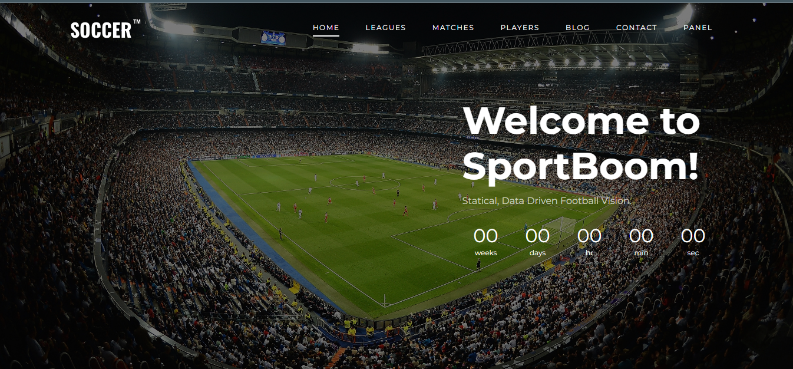
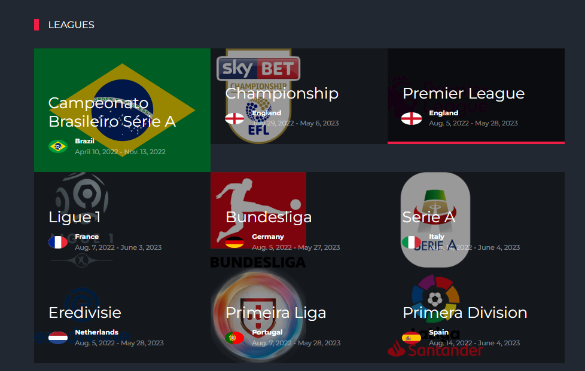
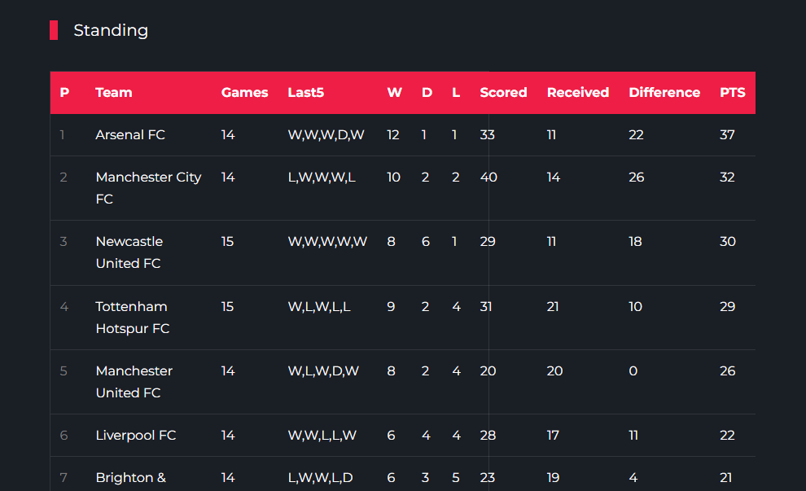
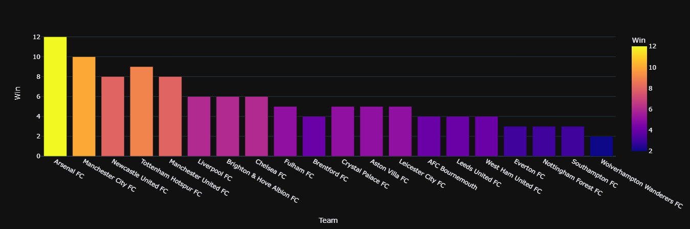
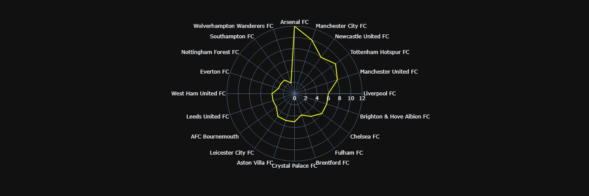
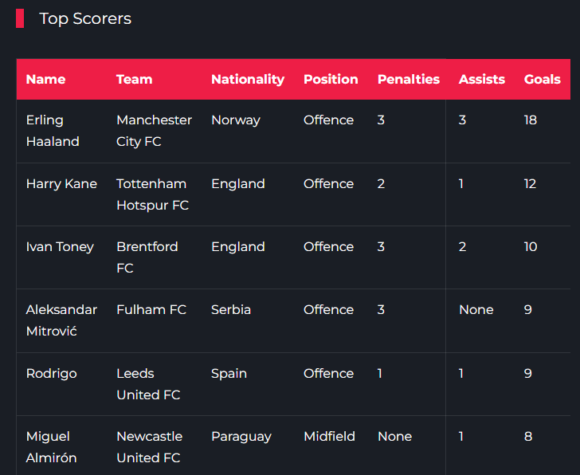
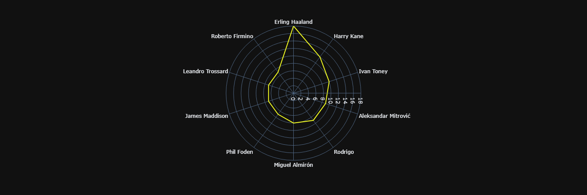
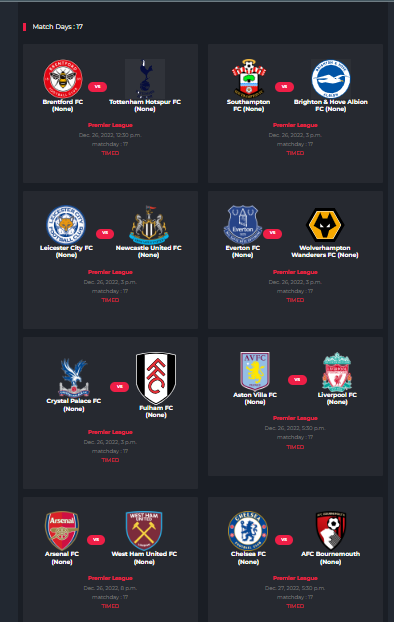
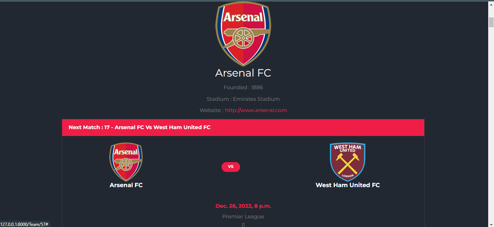

# SportBoom

## data-driven project

 

  <h2>SportBoom Header</h2>
  

---

  <h2>SportBoom Leagues</h2>
  

---

<h2>SportBoom Standing for each League</h2>
  

---

  <h2>Bar plot base on League data</h2>
  

---

  <h2>Polar plot base on League data</h2>
  

---

  <h2>SportBoom Top Scorers for each League</h2>
  

---

  <h2>Polar plot base on Scorer data</h2>
  

---

  <h2>All the League Matches :</h2>
  

---

  <h2>Team Detail Page</h2>
  

---

  <h2>All the Team Matches</h2>
  

---

  <h2>And cool update for Player info coming soon... :hourglass:</h2>

